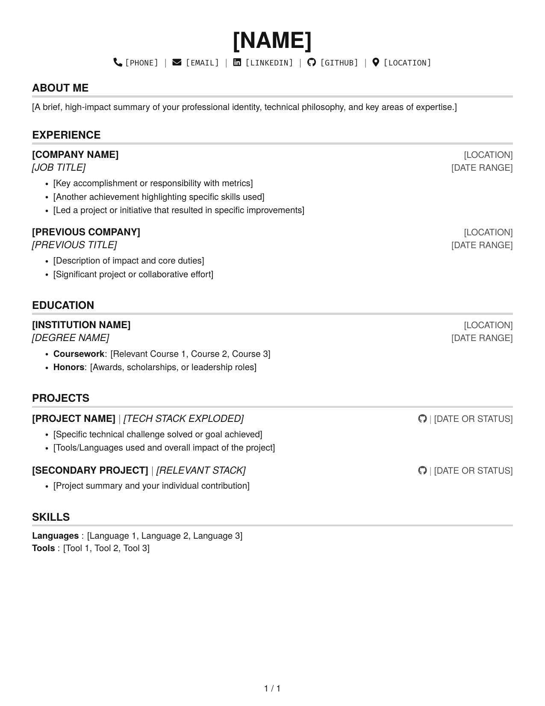

# Software Engineer Resume

[](out/resume.pdf)
[](https://www.latex-project.org/)
[](https://www.gnu.org/licenses/gpl-3.0.html)

This repository contains the source for my professional resume, designed with a custom-engineered LaTeX architecture.



## Technical Implementation

- **Modular Architecture**: Full custom command set — `\sectionHeader`, `\subSectionHeader`, `\projectHeader`, `\entry`, `\subEntry`, and `\field` — separates semantic content from visual formatting.
- **ATS Compatibility**: `\pdfgentounicode=1` ensures ligatures are parsed as plain text by applicant tracking systems.
- **Layout Precision**: Standardized 0.5in margins via `geometry` and centered pagination footer (`page / total`).
- **Modern Typography**: TeX Gyre Heros (sans-serif body) + Fira Mono (technical elements) for multi-platform clarity.

## Customization

To build your own resume using this architecture:

1. **Baseline**: Copy `src/resume_template.tex` to a new `.tex` file.
2. **Populate Content**: Use the commands below to build your profile:
   - `\sectionHeader{Company}{Location}{Title}{Date}` — experience and education entries
   - `\subSectionHeader{Role}{Date}` — secondary role at same organization
   - `\projectHeader{Name $|$ Stack}{Link $|$ Date}` — project entries
   - `\entry{...}` / `\subEntry{...}` — bullet points within any section
   - `\field{Label}{Value}` — key/value rows for the Skills section
3. **Compile**: Generate your PDF via `pdflatex`.

## Build

### Dependencies

Ensure a standard TeX distribution is installed (e.g., [TeX Live](https://www.tug.org/texlive/) or [MiKTeX](https://miktex.org/)). For comprehensive installation guidance, refer to the official [LaTeX Project](https://www.latex-project.org/get/).

### Compilation

```bash
pdflatex -output-directory=out src/resume.tex
```

## Credits

This project was inspired by the visual foundations of [Harshibar's Resume Template](https://www.overleaf.com/latex/templates/harshibars-resume/sbcyynmtpnyd). While the final output may visually look nearly the same, the underlying LaTeX core has been completely refactored into a custom, independent system.

## License

Licensed under the [GPL v3](https://www.gnu.org/licenses/gpl-3.0.html).
